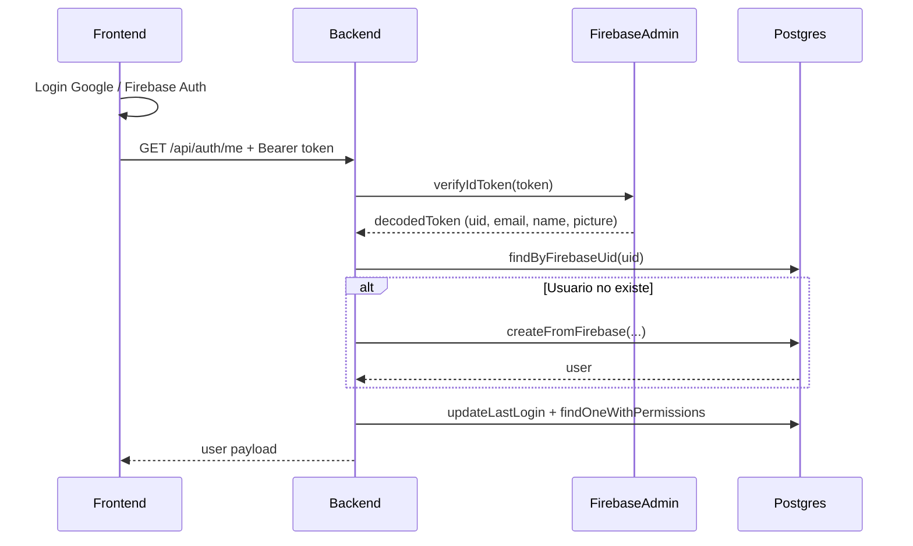

# Plan: Revisión y corrección de creación de usuario en Postgres al hacer login

## Flujo actual (resumen)

El usuario se crea en [FirebaseAuthGuard](backend/src/common/guards/firebase-auth.guard.ts) la primera vez que una petición autenticada llega al backend (p. ej. `GET /api/auth/me` desde [AuthContext](frontend/src/contexts/AuthContext.tsx) tras el login). Si en algún paso falla, el `catch` del guard devuelve siempre **401 "Token inválido"**, ocultando el error real (p. ej. fallo de BD o de Firebase Admin).

---

## 1. Carga de credenciales Firebase (backend)

**Archivo:** [backend/src/config/firebase-admin.config.ts](backend/src/config/firebase-admin.config.ts)

- **Orden de carga:** `ConfigModule.forRoot({ isGlobal: true })` está primero en [app.module.ts](backend/src/app.module.ts), así que `.env` se carga antes de que se importe `firebase-admin.config` (al construir `CommonModule` / `FirebaseAuthGuard`). No hace falta cambiar el orden.
- **Riesgo:** Si `FIREBASE_SERVICE_ACCOUNT_KEY` viene en varias líneas en `.env` o con caracteres especiales sin escapar, el valor puede leerse mal y `JSON.parse` puede lanzar o devolver un objeto inválido. Además, si falla el `parse`, no hay `try/catch` y el proceso puede romperse o quedar `firebaseAuth === null` sin un mensaje claro.

**Acciones recomendadas:**

- En `firebase-admin.config.ts`: hacer `JSON.parse` dentro de un `try/catch`; en caso de error, loguear un mensaje explícito (por ejemplo: "FIREBASE_SERVICE_ACCOUNT_KEY inválido o no definido") y dejar `serviceAccount = null`.
- Opcionalmente: comprobar que el objeto parseado tenga propiedades mínimas esperadas (p. ej. `client_email`, `project_id`) antes de llamar a `admin.credential.cert(serviceAccount)`; si no, no inicializar la app y loguear advertencia.
- Documentar en comentario o README que la variable debe ser el JSON en **una sola línea** (minificado), para evitar problemas con saltos de línea en `.env`.

---

## 2. Errores en el guard enmascarados como "Token inválido"

**Archivo:** [backend/src/common/guards/firebase-auth.guard.ts](backend/src/common/guards/firebase-auth.guard.ts)

Hoy todo lo que lanza el `try` (incluido `createFromFirebase` o `findOneWithPermissions`) cae en el mismo `catch` y se convierte en `UnauthorizedException('Token inválido')`. Así, un fallo de base de datos o de lógica (p. ej. constraint único) se ve en el cliente como 401 y no se ve en logs.

**Acciones recomendadas:**

- En el `catch`:
  - Si el error es de Firebase (p. ej. `error.code === 'auth/id-token-expired'`), seguir devolviendo 401 con mensaje concreto ("Token expirado").
  - Para el resto: **loguear el error completo** (por ejemplo con `Logger` de NestJS), incluyendo `err.message` y, si existe, `err.stack`, para poder diagnosticar en servidor.
  - Para errores que **no** sean `UnauthorizedException` ni errores de Firebase (p. ej. errores de TypeORM / Postgres): lanzar una respuesta de error de servidor (p. ej. `throw new InternalServerErrorException('Error al crear o obtener usuario')` o similar) en lugar de "Token inválido", para que en el frontend no se interprete como problema de credenciales y en logs quede claro que el fallo fue en BD o en creación de usuario.
- Opcional: al entrar en la rama `if (!user)` y antes de `createFromFirebase`, loguear un mensaje tipo "Creando usuario en BD desde Firebase", para confirmar en logs que ese camino se ejecuta.

---

## 3. Restricción única en `email` y valor vacío

**Archivo:** [backend/src/database/entities/user.entity.ts](backend/src/database/entities/user.entity.ts)

- La columna `email` está definida como `@Column({ unique: true })` y **no** es `nullable`. En [users.service.ts](backend/src/modules/users/users.service.ts) se usa `decodedToken.email || ''`. Si el token no trae email (poco común con Google, pero posible según scopes o proveedor), se guardaría `''`.
- Si dos usuarios sin email se crean, el segundo fallaría por **unique constraint** en `email`. Ese error sería uno de los que hoy se enmascaran como "Token inválido" (y con el punto 2 pasaría a verse como error de servidor y en logs).

**Acciones recomendadas:**

- Decisión de producto: si queremos permitir usuarios sin email desde Firebase, hay que evitar `''` repetido. Opciones:
  - **A)** Hacer `email` nullable en la entidad y guardar `null` cuando `decodedToken.email` venga vacío/undefined.
  - **B)** Usar un valor único cuando no haya email, por ejemplo `firebase_${firebaseUid}@local`, para no violar el unique.
- Implementar una de las dos opciones en `createFromFirebase` (y, si aplica, migración para hacer `email` nullable o ajustar datos existentes). Así se evita que la primera creación de usuario falle por constraint sin que quede claro en la respuesta.

---

## 4. Comprobaciones rápidas en tu entorno (sin cambiar código)

- **Backend:** Al arrancar, revisar que no haya errores en consola relacionados con Firebase o `JSON.parse`. Si hubiera problema con `FIREBASE_SERVICE_ACCOUNT_KEY`, suele verse al cargar el módulo que importa `firebase-admin.config`.
- **Mismo proyecto:** El **Service Account** del backend debe ser del **mismo proyecto** de Firebase que usan las variables `VITE_FIREBASE_*` en el frontend. Proyecto distinto implica `verifyIdToken` fallando.
- **Frontend:** En DevTools → Network, al hacer login, confirmar que existe la petición a `GET .../api/auth/me` y comprobar el **status code** (200 vs 401/500). Si es 401, con los cambios del punto 2 podrás ver en logs del backend el error real (Firebase vs BD).
- **Base de datos:** Tras un login "exitoso" en la app (sin error visible), comprobar en Postgres si existe una fila en `users` con tu `firebase_uid` (o con tu email). Si no existe y la petición a `/auth/me` devuelve 200, entonces el guard estaría devolviendo un usuario creado en memoria o habría que revisar qué respuesta está enviando realmente el endpoint.

---

## 5. Sobre borrar usuario en Firebase

No es necesario borrar el usuario en Firebase solo para "volver a guardar" en Postgres. Si el flujo está bien:

- La primera vez que una petición con token válido llega al backend, se crea el usuario en Postgres.
- Si en Postgres ya existe un usuario con ese `firebase_uid` pero con datos incorrectos (p. ej. email vacío), se puede borrar **solo esa fila en la tabla `users**` y volver a hacer login; el guard creará de nuevo el usuario. Opcionalmente puedes borrar también el usuario en Firebase si quieres un UID nuevo, pero no es necesario para que se "guarde el correo" en Postgres; lo que hace que se guarde es que `createFromFirebase` se ejecute sin fallos y que el token incluya `email` (y/o aplicar la decisión del punto 3 para cuando no venga email).

---

## Resumen de cambios propuestos

| Área              | Archivo                                                                                                  | Cambio                                                                                                                                         |
| ----------------- | -------------------------------------------------------------------------------------------------------- | ---------------------------------------------------------------------------------------------------------------------------------------------- |
| Firebase Admin    | `backend/src/config/firebase-admin.config.ts`                                                            | Try/catch en `JSON.parse`, validación mínima del service account, log claro si la key es inválida.                                             |
| Guard             | `backend/src/common/guards/firebase-auth.guard.ts`                                                       | Diferenciar errores de Firebase vs otros; loguear siempre el error real; devolver 5xx para fallos de BD/creación en lugar de "Token inválido". |
| Usuario sin email | `backend/src/database/entities/user.entity.ts` (opcional) y `backend/src/modules/users/users.service.ts` | Hacer `email` nullable o usar placeholder único cuando `decodedToken.email` venga vacío, para evitar unique constraint.                        |

Con esto se mantiene la configuración actual de Firebase que comentas, pero se hace más robusta la carga de credenciales y, sobre todo, se deja de ocultar el error real cuando el usuario no se crea en Postgres (verás la causa en logs y en el tipo de respuesta HTTP).